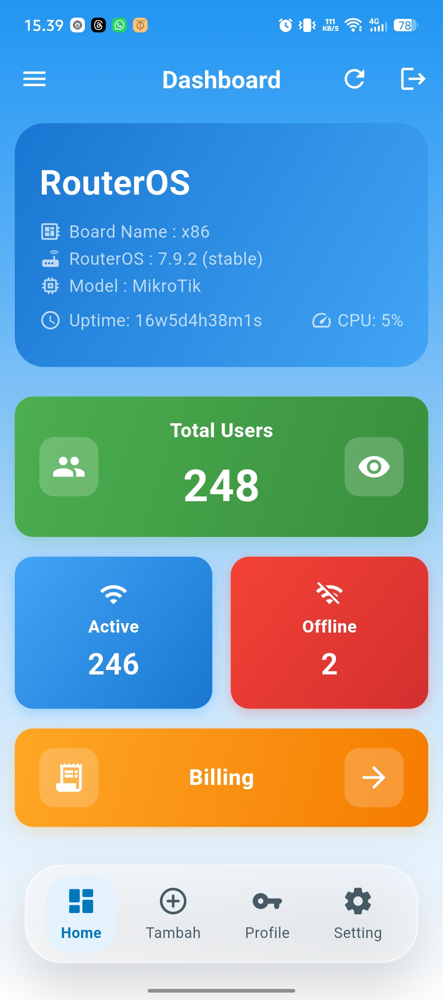
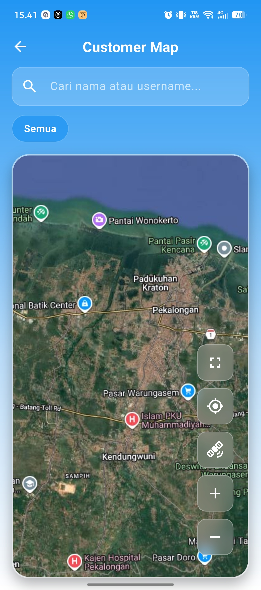
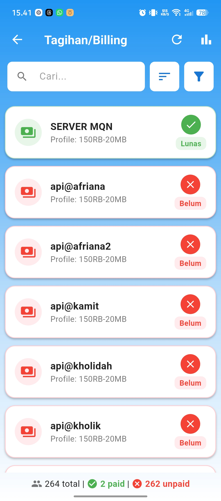

# 📡 Mikrotik PPPoE Monitor & Billing System

Aplikasi **Mikrotik PPPoE Monitor** adalah solusi cerdas berbasis Flutter untuk manajemen pelanggan RT/RW Net dan ISP secara menyeluruh. Terintegrasi secara *real-time* dengan Mikrotik RouterOS dan sistem *Database* (MySQL) menggunakan *Middleware* API khusus.

  
  
  

## 📚 Dokumentasi Resmi (Super Lengkap!)

Semua panduan instalasi, penjelasan arsitektur, panduan *developer*, hingga tutorial penggunaan harian **telah kami pindahkan** ke dalam Website Dokumentasi interaktif kami yang dibangun menggunakan Docusaurus.

👉 **[BACA DOKUMENTASI LENGKAP DI SINI](https://oippiu10.github.io/Monitoring-PPPoE-Mikrotik-Flutter/)** 👈
*(Atau Anda dapat menjalankannya secara lokal dengan masuk ke folder `website_docs` dan menjalankan `npm start`)*

### Apa yang ada di dalam Dokumentasi?
- 🚀 **Panduan Mulai Cepat (Quick Start 5 Menit)**
- 📖 **User Guide (Panduan Manajemen Tagihan, Maps, & Suspend User)**
- ⚙️ **Konfigurasi Lingkungan Server (.env) & RouterOS**
- 💻 **Bongkar Arsitektur Sistem (State Management & Flow API)**
- 📸 **Galeri Lengkap UI Aplikasi (Glassmorphism Mode)**

---

## ✨ Fitur Unggulan Singkat

1. **Pemantauan Kinerja Real-Time**: Pantau CPU, RAM, Suhu Router, dan Grafik Trafik *Bandwidth* interaktif langsung dari HP Anda.
2. **Customer Map Interaktif**: Melacak lokasi rumah pelanggan dan infrastruktur ODP lengkap dengan sistem navigasi otomatis ke *Google Maps*.
3. **Manajemen Tagihan Cerdas**: Catat pembayaran, kelola penunggak, dan sistem pemotongan saldo "Titipan" secara otomatis.
4. **Auto-Update (OTA)**: Pembaruan versi aplikasi teknisi langsung dari server internal, tanpa bergantung pada Google Play Store.

---

*Dikembangkan untuk efisiensi operasional ISP masa kini.*
