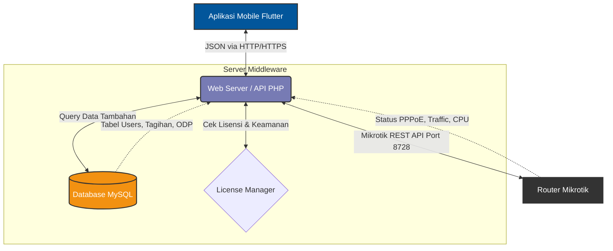

# Arsitektur Sistem & Tech Stack

Aplikasi ini menggunakan pola arsitektur **3-Tier (Client-Server-Mikrotik)** untuk memastikan perangkat *mobile* beroperasi ringan, sementara server melakukan pekerjaan berat (komputasi data).

## 🗺️ Diagram Alur Sistem (Topologi)

Berikut adalah diagram bagaimana aplikasi berinteraksi dengan server dan router Mikrotik:

## 🧩 State Management (Provider di Flutter)

Di sisi klien (Aplikasi Flutter), pola desain *Clean Architecture* diterapkan dengan memisahkan *Logic* dan *UI*.

1. **Layer UI (`lib/screens/`)**: Hanya bertugas menampilkan tombol, warna, grafik, dan menangkap gestur (*tap, swipe*). **Tidak boleh** ada pemanggilan API langsung di sini.
2. **Layer State (`lib/providers/`)**: Bertugas menyimpan sementara data dari *server* ke memori RAM HP. Contoh:
   - `BillingProvider`: Menyimpan ratusan data tagihan, menyortir pelanggan yang lunas/belum lunas tanpa membuat HP menjadi *lag* karena menggunakan teknik *Local Caching*.
   - `AuthProvider`: Menyimpan *token* sesi Mikrotik, sehingga teknisi bisa membuka/tutup aplikasi tanpa *login* ulang berkali-kali.
3. **Layer Data (`lib/services/`)**: Fungsi murni untuk berkomunikasi dengan *Backend PHP*. Segala jenis *error* (seperti Internet Mati atau Server *Down*) ditangkap (*Try-Catch*) di layer ini sebelum dilempar sebagai notifikasi elegan ke pengguna.

## 🚀 Manajemen Pemrosesan Asinkron (Isolates)

Untuk memastikan UI dengan gaya *Glassmorphism* tidak patah-patah (*stuttering*) saat memuat 10.000 pelanggan PPPoE, aplikasi menggunakan teknik **Isolate** di Dart. *Isolate* bekerja mem-*parsing* file JSON berukuran raksasa di *background thread*, sehingga animasi UI di *main thread* (60 Frame per detik) tetap berjalan mulus (*buttery smooth*).
